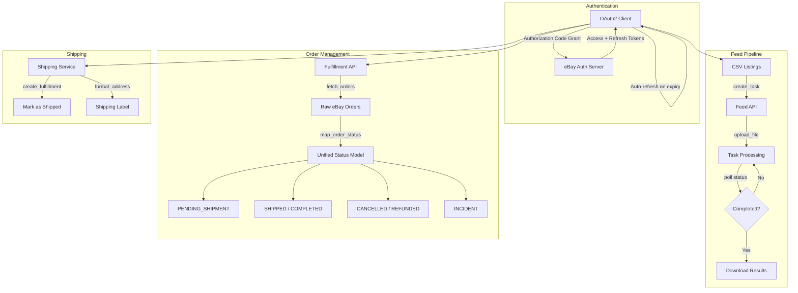

# eBay Automation Toolkit


Production-grade Python toolkit for eBay REST API integration. Handles OAuth2 authentication, bulk listing uploads via the Feed API, order management through the Fulfillment API, and shipping automation — all in a clean, testable architecture with zero database dependencies.

## Architecture



## Quick Start

### 1. Install dependencies

```bash
pip install -r requirements.txt
```

### 2. Configure credentials

```bash
cp .env.example .env
# Edit .env with your eBay Developer Program credentials
```

| Variable | Description |
|----------|-------------|
| `EBAY_CLIENT_ID` | Your eBay app Client ID |
| `EBAY_CLIENT_SECRET` | Your eBay app Client Secret |
| `EBAY_RUNAME` | Your Redirect URI Name (RuName) |
| `EBAY_MARKETPLACE_ID` | Target marketplace (e.g., `EBAY_ES`, `EBAY_US`) |

### 3. Run the demo

```bash
python examples/full_workflow.py
```

## Usage Examples

### OAuth2 Authentication

```python
from src.auth import EbayOAuth2Client

auth = EbayOAuth2Client()

# Step 1: Get the authorization URL
url = auth.get_authorization_url(state="my_session")
print(f"Open in browser: {url}")

# Step 2: Exchange the code (after user consent)
auth.exchange_code_for_tokens("authorization_code_here")

# Step 3: Use tokens (auto-refreshes when expired)
token = auth.get_valid_token()
headers = auth.get_auth_header()  # {"Authorization": "Bearer ..."}
```

### Bulk Listing Upload (Feed API)

```python
from src.feed import EbayFeedClient

feed = EbayFeedClient(auth_client=auth)

# Upload a single file and wait for processing
result = feed.upload_and_wait("listings.csv")
print(f"Status: {result.status}")  # COMPLETED, FAILED, COMPLETED_WITH_ERROR

# Upload multiple files sequentially
results = feed.upload_multiple(["batch_1.csv", "batch_2.csv"])
```

### Order Management (Fulfillment API)

```python
from src.orders import EbayFulfillmentClient

orders_client = EbayFulfillmentClient(auth_client=auth)

# Fetch recent orders with unified status mapping
orders = orders_client.fetch_orders(days_back=7)

for order in orders:
    print(f"[{order.status}] {order.order_id} - {order.total_amount} {order.currency}")
    if order.buyer:
        print(f"  Ship to: {order.buyer.name}, {order.buyer.city}")
```

### Shipping Automation

```python
from src.shipping import EbayShippingService

shipping = EbayShippingService(auth_client=auth)

# Mark order as shipped
fulfillment_id = shipping.create_shipping_fulfillment(
    order_id="12-34567-89012",
    tracking_number="1Z999AA10123456784",
    carrier_code="UPS",
)

# Format address for shipping label
label = shipping.format_address_for_label({
    "name": "Juan García",
    "address_line1": "Calle Mayor 10",
    "city": "Madrid",
    "postal_code": "28001",
    "country_code": "ES",
})
print(label)
```

## Unified Status Model

eBay uses three independent status fields per order. This toolkit maps them to a single unified state for cross-platform consistency:

| eBay Payment | eBay Fulfillment | eBay Cancel State | → Unified Status |
|---|---|---|---|
| PAID | NOT_STARTED | NONE_REQUESTED | `PENDING_SHIPMENT` |
| PAID | IN_PROGRESS | NONE_REQUESTED | `SHIPPED` |
| PAID | FULFILLED | NONE_REQUESTED | `COMPLETED` |
| * | * | CANCELLED | `CANCELLED` |
| REFUND | * | * | `REFUNDED` |
| FAILED | * | * | `INCIDENT` |
| * | * | CANCEL_REQUESTED | `INCIDENT` |

## Design Decisions

### Why OAuth2 Authorization Code Grant (not Client Credentials)?

Client credentials only provide access to public data. To manage a seller's orders, listings, and shipping, we need the authorization code flow — it grants user-consented scopes like `sell.fulfillment` and `sell.inventory` that client credentials cannot access.

### Why Feed API for Bulk Listings (not Inventory API)?

The Inventory API is designed for individual item CRUD operations. For bulk operations (hundreds or thousands of listings), the Feed API is significantly more efficient: upload a single CSV, let eBay process it asynchronously, and download the results. This reduces API calls from N to 3 (create → upload → download).

### Why a Unified Status Model?

eBay's order status is split across three independent fields (`orderPaymentStatus`, `orderFulfillmentStatus`, `cancelStatus.cancelState`). When building cross-platform tools (eBay + Amazon + Wallapop), a unified status model simplifies downstream logic — one status field to check instead of three combinations per platform.

## Testing

```bash
python -m pytest tests/ -v
```

All HTTP calls are mocked — no eBay credentials needed to run the test suite.

## Project Structure

```
ebay-automation-toolkit/
├── src/
│   ├── auth/oauth2.py           # OAuth2 authorization code flow + token refresh
│   ├── feed/feed_client.py      # Feed API: bulk listing upload pipeline
│   ├── orders/fulfillment.py    # Fulfillment API: order fetch + status mapping
│   └── shipping/shipping_service.py  # Shipping: fulfillment creation + label formatting
├── tests/                       # 30+ unit tests with mocked HTTP
├── examples/full_workflow.py    # End-to-end demo script
├── .env.example
├── requirements.txt
└── README.md
```

## Related Projects

- **[AI Product Enrichment](https://github.com/AspiranteD/ai-product-enrichment)** — GPT-powered product description and metadata generation
- **[Amazon Product Scraper](https://github.com/AspiranteD/amazon-product-scraper)** — Automated product data extraction from Amazon
- **[Wallapop Data Extractors](https://github.com/AspiranteD/wallapop-data-extractors)** — Wallapop marketplace data collection tools

## License

MIT — see [LICENSE](LICENSE) for details.
